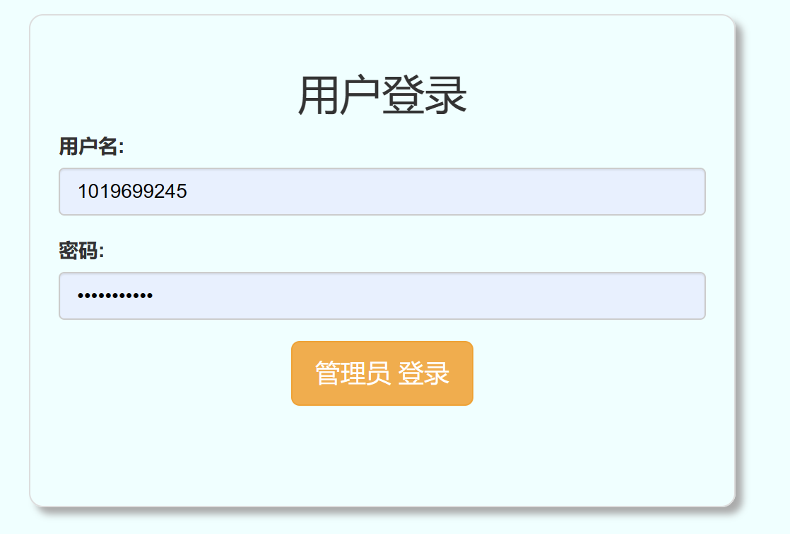
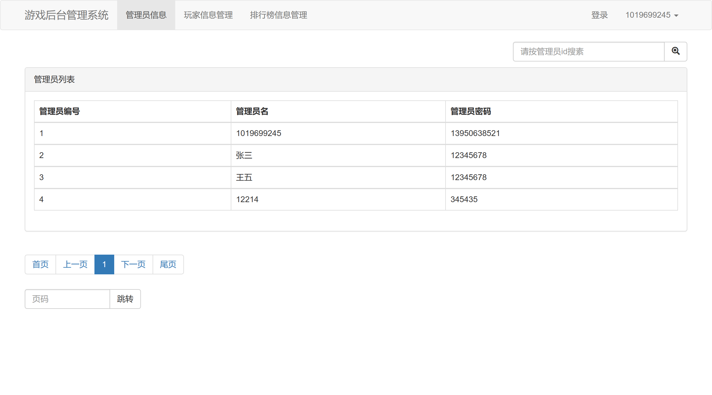
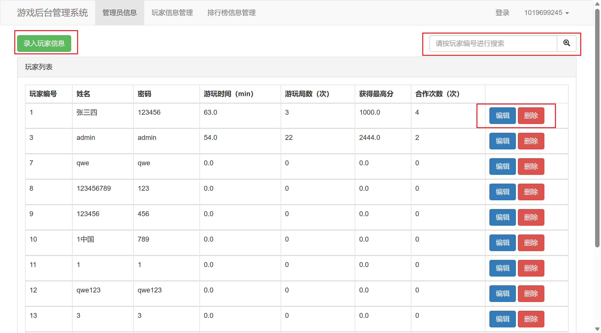
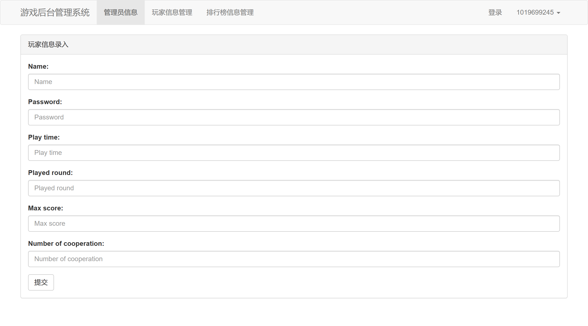
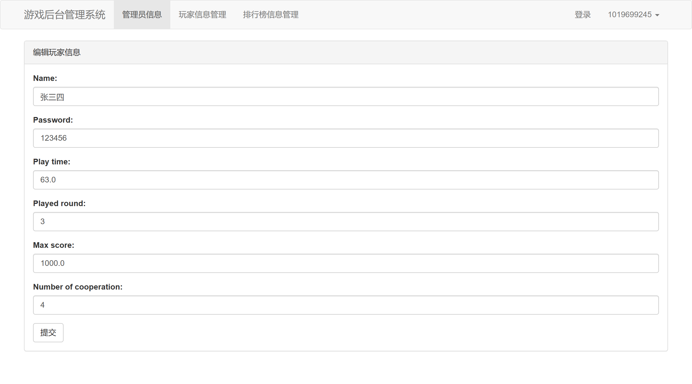
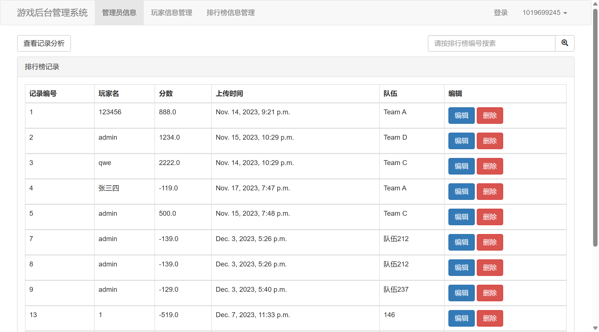
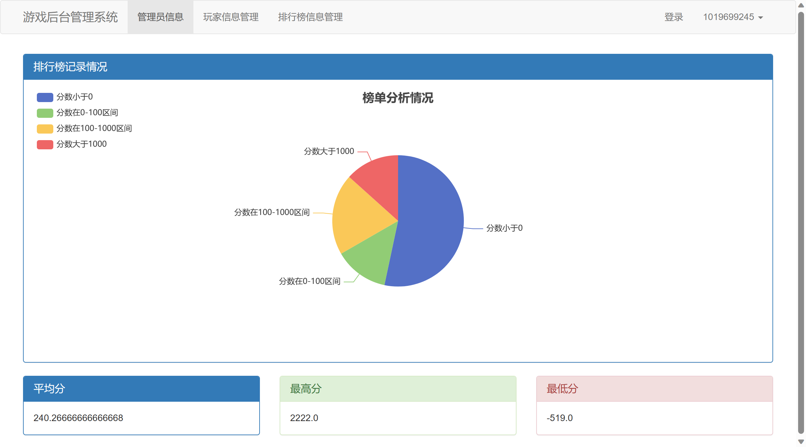

# background

使用dajngo开发的后台游戏后台管理


#### 运行方式

clone后在目录运行``` python .\manage.py runserver```命令即可运行django，进入127.0.0.1:8000/login 页面即可看到游戏后台

#### 实现内容

- 管理员信息查看
- 玩家信息管理
- 排行榜记录管理
- 排行榜记录分析查看

## 项目使用方式介绍

进入后会自动跳转登录页面



可以使用```用户名：1019699245 ；密码：13950638521```登录系统进行测试（请勿在演示前删除系统内数据）

#### 管理员信息页

首页会显示所有管理员信息，可以使用管理员id号进行查找



#### 玩家信息管理页

使用最上方的导航栏可以进入玩家信息管理页面，查看管理玩家信息



可以进行添加新玩家信息、编辑、删除玩家信息以及搜索玩家信息等操作。

添加新玩家信息：



编辑玩家信息：



#### 排行榜信息管理页

使用导航栏进入排行榜信息管理页



可以查看排行榜的记录分析以及编辑、删除排行榜信息

排行榜信息分析：

